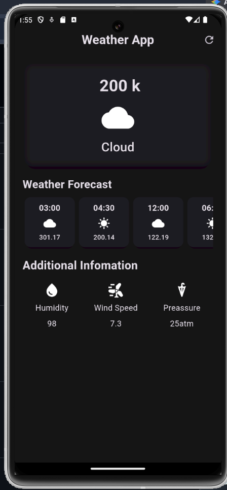

# 🌦️ Weather App

A modern Flutter Weather Application that provides real-time weather information using the OpenWeather API. Users can quickly check current weather conditions for any city through a clean and responsive user interface.

---

## ✨ Features

* Real-Time Weather Data using OpenWeather API
* Search Weather by City Name
* Displays Current Temperature
* Weather Condition Information
* Responsive and User-Friendly Flutter UI
* Fast API Integration and Data Fetching
* Error Handling for Invalid City Searches
* Clean and Simple User Experience

---

## 📱 App Screen

### 🌤️ Weather Dashboard

The main screen of the application allows users to search for any city and instantly view current weather information. The app fetches live data from the OpenWeather API and displays important details such as temperature, weather conditions, and location information in a visually appealing interface.

  

---

## 🔗 API Used

This application uses the **OpenWeather API** to retrieve real-time weather information.

---

## 🛠️ Tech Stack

* Flutter
* Dart
* OpenWeather API
* HTTP Package

---

## 🎯 Key Concepts Demonstrated

* REST API Integration
* JSON Parsing
* Asynchronous Programming
* HTTP Requests & Responses
* State Management
* Responsive UI Design
* Error Handling
* Flutter Widget Composition

---

## 🚀 Future Improvements

* 5-Day Weather Forecast
* Hourly Weather Updates
* Current Device Location Support
* Weather Icons and Animations
* Dark Mode Support
* Multiple City Tracking

